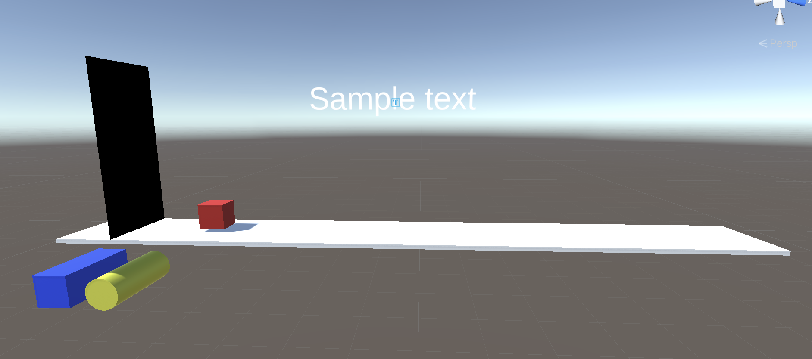
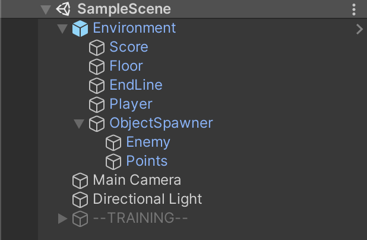
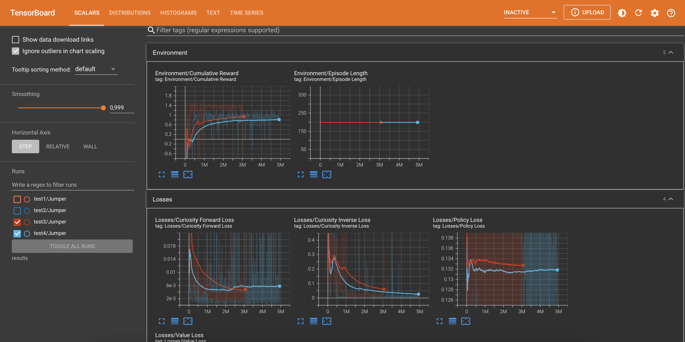
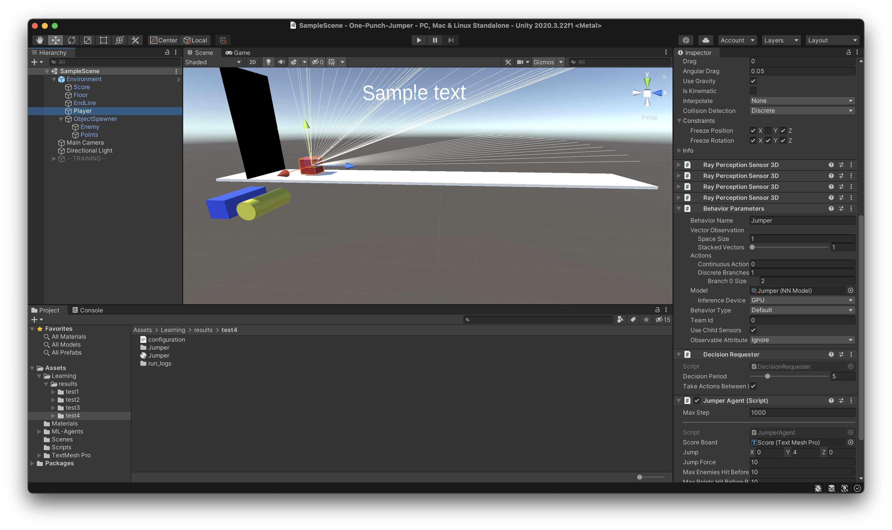

# One-Punch-Jumper
The agent is on a track where enemy object and coins pass by.
It is the agents job to avoid the enemies by jumping over them and collecting the coins.

These enemies and coins will charge at the agent at variable speeds and on variable heights.

## Scene

A small red block representing the agents stands on the far left of a track.

There is an invisible  GameObject called "ObjectSpawner" situated at the right side of the track.
It contains 2 GameObjects:
- An Enemy object (Blue elongated cube)
- A Points object (Yellow cylinder)  

This GameObject will be responsible for spawning the enemies and points.

At the end of the track you can find the EndLine object. When an enemy or point collides with this, they will dissapear.

## Scripts

This image will help visualise where scripts are placed. 

### ScoreHelper
The purpose of this script is to keep tracks of the scores and punishments.
The instance of this script will be as a component of the Environmnet.

### EndLineLogic
This script is a component of the Endline object and will help to determine when to add scores or punishments.
As well as destroy any colliding object.

If the colliding object has an Enemy Tag, a success will be added to the ScoreHelper.
If the colliding object has a Points tag, a punishment will be added to the ScoreHelper.

### ObjectSpawnBehavior
This script is a component of the ObjectSpawner object.

Every time when Update is called, it will compare the passed time to the "rate of fire".

When enough time has passed, the timer will be reset and the shootObject method will be called.
Here will randomly be decided wether the spawned object is an enemy or a point. The chances are 50/50.

### JumperAgent
This script is part of the Player object.
The component is what will allow the AI to control the jumper and learn.
As well as set up and end episodes.

Besides this it will manage all points and punishments. When an enemy object collides with the player object, a punishment is added and the enemy object is destroyed. When a points object collides with the player object, a reward is added and the points object is destroyed. 

#### Update
In the Update method, the ScoreHelper will be used to check if a reward or punishment should be added as well as end the episode when too many enemies have been hit or points have been missed.

#### OnEpisodeBegin
At the start of every episode, the scores and counters will be reset.

#### OnActionReceived
This will handle the chosen actions.
In this case it'll either do nothing, or jump.
The action jump is only executed if the agent is grounded. This will prevent jumping mid-air. 

#### Heuristic
This method will take the keyboard input to be able to control the agent manually.

#### OnCollisionEnter
Here a punishment or reward will be added when the player collides with an enemy or point. It will also destroy the points/enemy object. 

#### OnCollisionStay
This will be used to detect when the agent is standing on the ground. And thus able to jump.

## Perception Sensors
To allow the AI to actually perceive things, four sets of Ray Perception Sensors will be used.
The Ray Perception Sensors originate from the player.
These sensors will be used at different angles to detect the enemies and coins at the diferent heights.

## Reward System
The agent needs to be rewarded and punished in order to be able to learn.

### Rewards
The agent gets rewarded on the following occasions:
    - Every second that the agent is alive, a small reward will be given.
    - When an enemy hits the EndLine object, a reward will be given.
    - When the agent hits a point, a reward will be given.

### Punishments
The agent will get punished when the following happens:
    - When the agent hits an enemy, a large punishement will be dealt
    - When a point hits the EndLine object, a large punishment will be dealt.

## Results & conclusion

Graph 3 and 4 are relevant to this training. 

Graph 3 represents the training when the neural network was only fed with the enemy object as input. 
Graph 4 represents the training when the neural network was fed all necessary data. In other words, both the enemy and the coins object. 

It is possible that graph 3 could accumulate a higher score as the "shoot rate" of the objects was faster when trianing the model. 

As we can se the training fluctuates strongly up and down in between 0 and 500.000 steps. After which it stabelises and steadily gets better. At around 1.500.000 steps the graph flattens and has reached it's optimal performance. Here it will get an average score of around 0,7 as it's learned the difference between coins and enemies as well as the moment it needs to jump. After 1.500.000 steps it only improves slightly. Training it further would have no significant impact to the model.  

A video of our result can be found [here](https://ap.cloud.panopto.eu/Panopto/Pages/Viewer.aspx?id=db7f95e2-fe99-4096-af02-adfa010467a4).

## Reproducing & testing

If you want to test our trained brain, you need to make sure you select the correct brain and insert it in the behavior parameters component in the player object. 

You can find the brain in Assets > Learning > Results > test4 > Jumper. 
It is very important you use this brain as the others are not fit for this environment. 

If everything is set, just press play. 

If you want to train the model you can enable the training environment. This contains 63 exact copies of the environment you see here. This will ensure a faster training process. 
If you want to edit these, edit the prefab environment. This will ensure you don't have to copy the complete environment and set everything up manually.
